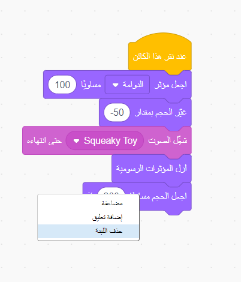
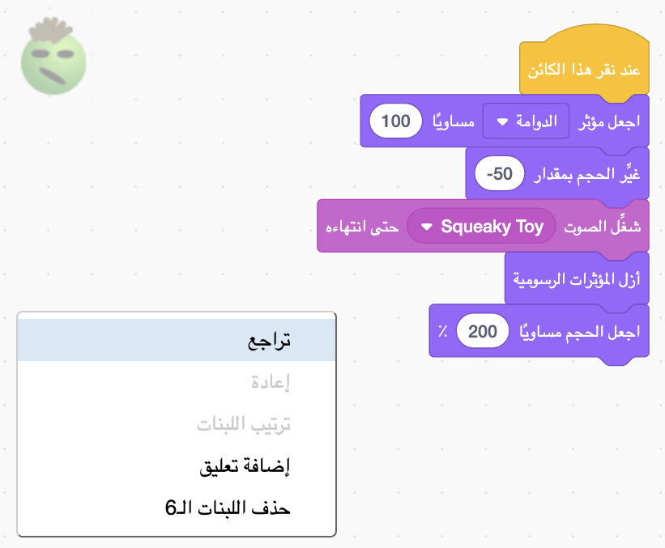
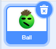
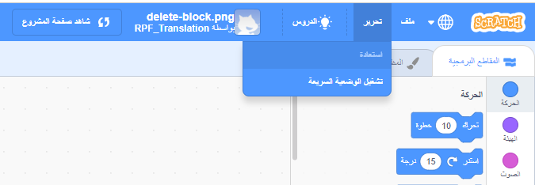
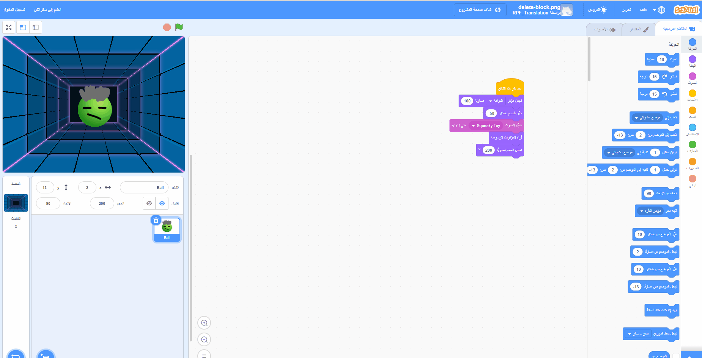

يمكنك حذف كتلة بالنقر بزر الماوس الأيمن عليها واختيار **حذف اللبنة** من القائمة.

{:width="300px"}

لحذف مجموعة من الكتل، انقر بزر الماوس الأيسر على الكتلة العلوية التي تريد حذفها واسحبه إلى قائمة الكتل. سيتم حذف جميع الكتل الموجودة تحتها أيضًا.

لاستعادة الكتل التي قمت بحذفها عن طريق الخطأ ، انقر بزر الماوس الأيمن وحدد **تراجع** من القائمة.

{:width="300px"}

--- no-print ---

--- /no-print ---

يمكنك أيضًا حذف كائن بالنقر فوق سلة مهملات الكائن في جزء الجانبي منه.

{:width="200px"}

لاستعادة كائن ما ، بما في ذلك جميع كتل التعليمات البرمجية الخاصة به ، انتقل إلى قائمة "تعديل" وحدد **استعادة الكائن**

{:width="400px"}

--- no-print ---

--- /no-print ---
