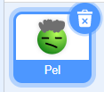

Galli di ddileu bloc drwy dde-glicio arno a dewis **Dileu Bloc** o'r ddewislen.

{:width="300px"}

I ddileu grŵp o flociau, clicia gyda'r botwm chwith ar y bloc uchaf rwyt ti am ei ddileu a'i lusgo i'r ddewislen Blociau. Bydd yr holl flociau oddi tano yn cael eu dileu hefyd.

I adfer blociau rwyt ti wedi'u dileu trwy gamgymeriad, de-gliciaa dewis **Dadwneud** o'r ddewislen.

{:width="300px"}

--- no-print ---

--- /no-print ---

Galli di hefyd ddileu corlun drwy glicio ar fin sbwriel y corlun yn y cwarel Corlun.

{:width="200px"}

I adfer corlun, gan gynnwys ei holl flociau cod, cer i'r ddewislen Golygu a dewis **Adfer Corlun**

{:width="400px"}

--- no-print ---

--- /no-print ---
