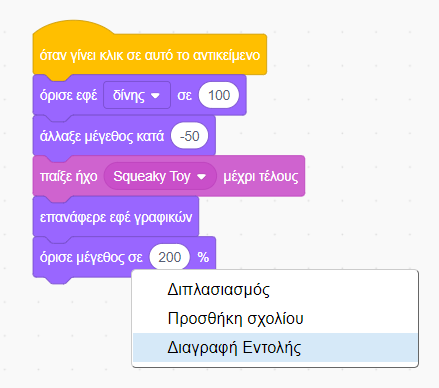
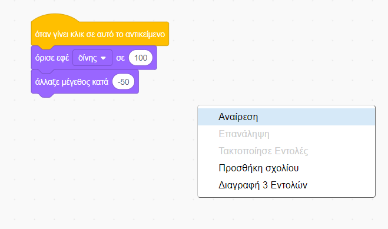
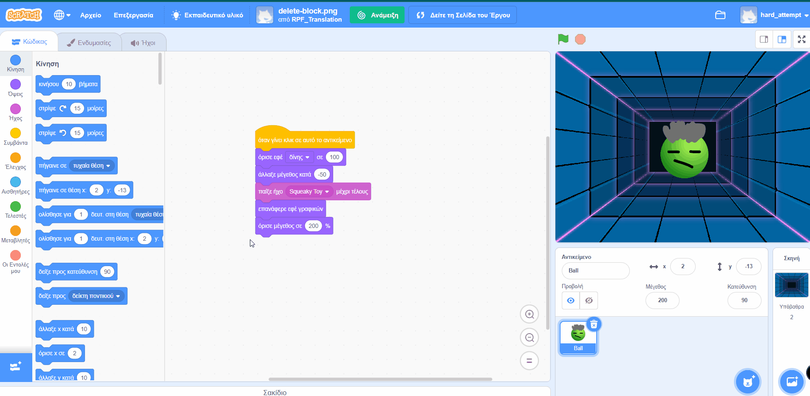
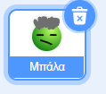
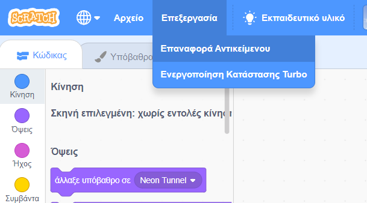
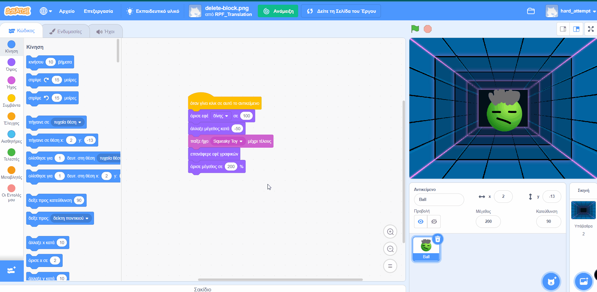

You can delete a block by right-clicking on it and selecting **Delete Block** from the menu.

{:width="300px"}

To delete a group of blocks, left-click on the top block to be deleted and drag it to the Blocks menu. All blocks underneath it will be deleted too.

To restore blocks you have deleted in error, right-click and select **Undo** from the menu.

{:width="300px"}

--- no-print ---

--- /no-print ---

You can also delete a sprite by clicking on the sprite's Trash can in the Sprite pane.

{:width="200px"}

To restore a sprite, including all of its code blocks, go to the Edit menu and select **Restore Sprite**

{:width="400px"}

--- no-print ---

--- /no-print ---
