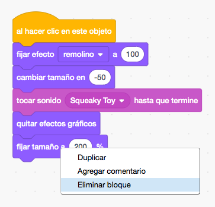
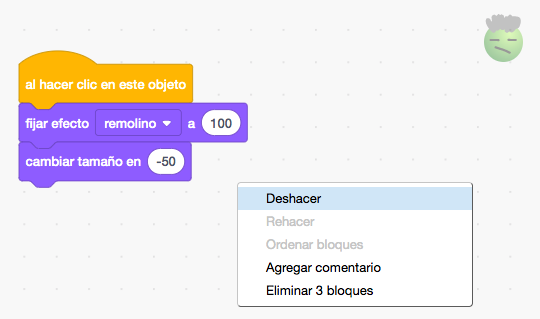
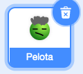
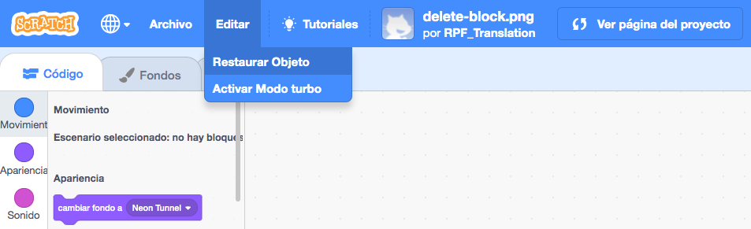

Puedes eliminar un bloque haciendo clic derecho en el bloque y seleccionando **Eliminar bloque** en el menú.

{:width="300px"}

Para eliminar un grupo, haz clic con el botón izquierdo en el bloque superior que quieres eliminar y arrástralo al Menú de bloques. Todos los que estén debajo de este también se eliminarán.

Para restaurar bloques que eliminaste por error, haz clic con el botón derecho y selecciona **Deshacer** en el menú.

{:width="300px"}

--- no-print ---

--- /no-print ---

También puedes eliminar un objeto haciendo clic en la papelera en el Panel de objetos.

{:width="200px"}

Para restaurar un objeto, con todos sus bloques de código, ve al menú Editar y selecciona **Restaurar Objeto**

{:width="400px"}

--- no-print ---

--- /no-print ---
