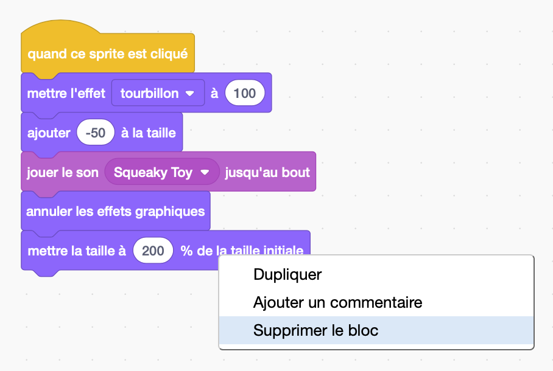
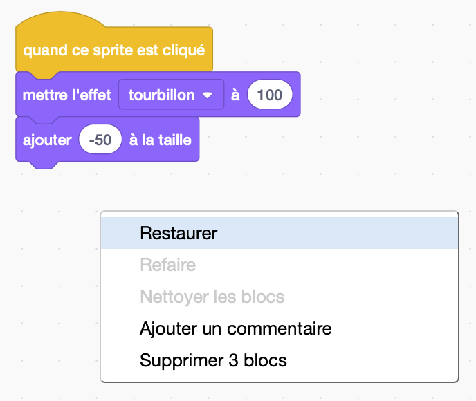
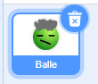
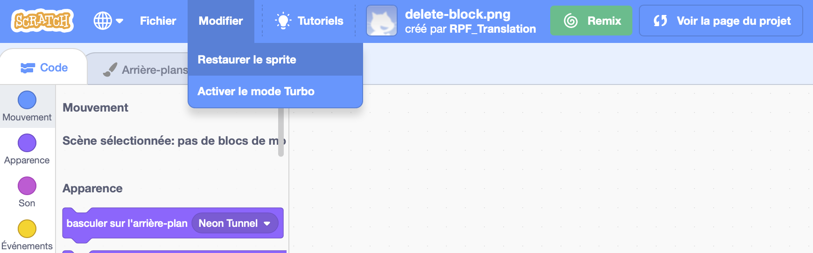

Tu peux supprimer un bloc en faisant un clic droit dessus et en sélectionnant **Supprimer le bloc** dans le menu.

{:width="300px"}

Pour supprimer un groupe de blocs, fais un clic gauche sur le bloc supérieur à supprimer et fais-le glisser vers le menu des blocs. Tous les blocs en dessous seront également supprimés.

Pour restaurer les blocs que tu as supprimés par erreur, fais un clic droit et sélectionne **Restaurer** dans le menu.

{:width="300px"}

--- no-print ---

--- /no-print ---

Tu peux également supprimer un sprite en cliquant sur la corbeille du sprite dans le volet Sprite.

{:width="200px"}

Pour restaurer un sprite, y compris tous ses blocs de code, va dans le menu Modifier et sélectionne **Restaurer le sprite**

{:width="400px"}

--- no-print ---

--- /no-print ---
