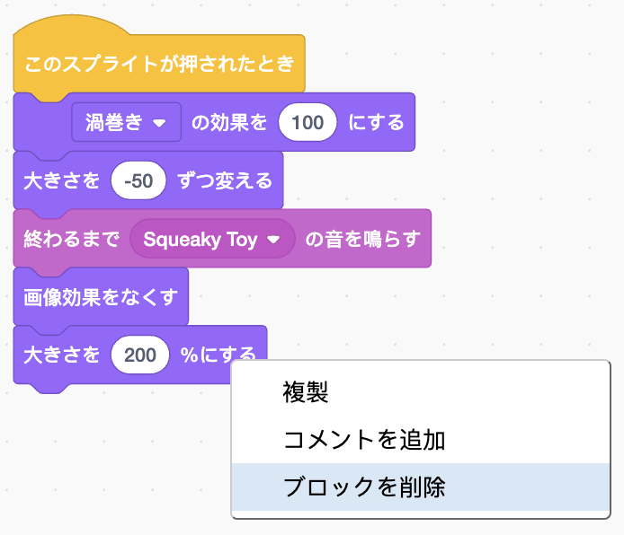
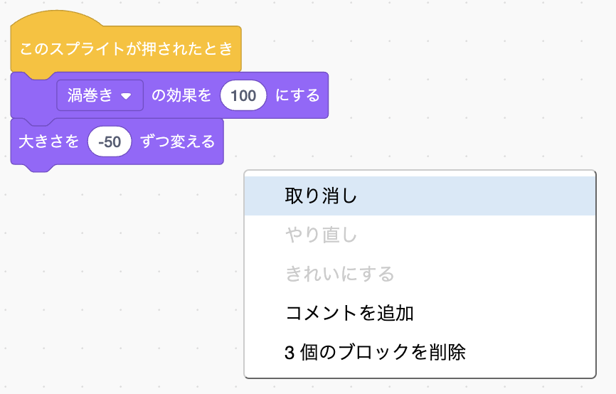
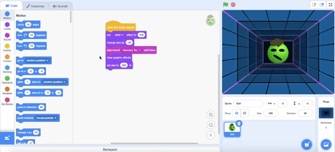
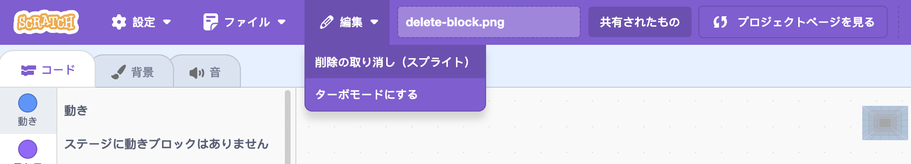
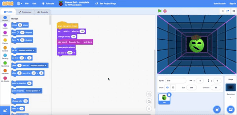

ブロックを削除するには、右クリックをして メニューにある**ブロックを削除**を選択してください。

{:width="300px"}

グループのブロックを削除するには、削除したいグループの一番上のブロックを左クリックしてブロックメニューにドラッグします。 それより下のブロックは全て削除されます。

削除したブロックを復元するには、右クリックをして、メニューから **取り消し**を選択してください。

{:width="300px"}

--- no-print ---

--- /no-print ---

スプライトペインにあるゴミ箱をクリックして、スプライトを削除することもできます。

{:width="200px"}

スプライトとコードのブロックを復元するには、編集メニューの、 **削除の取り消し**を選択してください。

{:width="400px"}

--- no-print ---

--- /no-print ---
