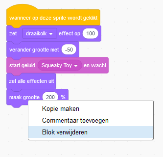
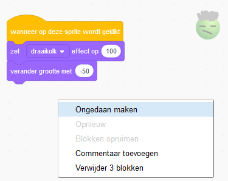
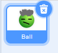
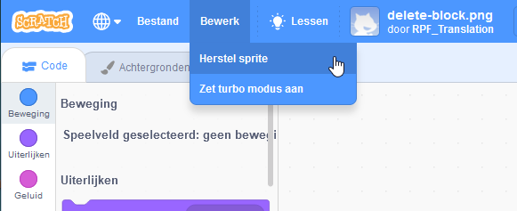

Je kunt een blok verwijderen door er met de rechtermuisknop op te klikken en **Blok verwijderen** te selecteren in het menu.

{:width="300px"}

Om een groep blokken te verwijderen, klik je met de linkermuisknop op het bovenste blok dat je wilt verwijderen en sleep je het naar het Blokken menu. Alle blokken eronder worden dan ook verwijderd.

Om blokken te herstellen die je per ongeluk hebt verwijderd, klik je met de rechtermuisknop en selecteer je **Ongedaan maken** in het menu.

{:width="300px"}

--- no-print ---

--- /no-print ---

Je kunt ook een sprite ook verwijderen door op de prullenbak van de sprite in het Sprite-paneel te klikken.

{:width="200px"}

Om een sprite te herstellen, inclusief alle codeblokken, ga je naar het Bewerk-menu en selecteer je **Herstel sprite**

{:width="400px"}

--- no-print ---

--- /no-print ---
