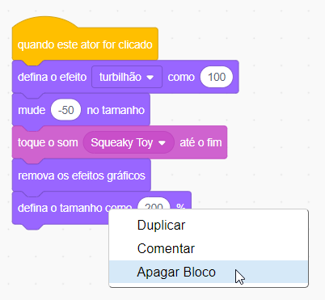
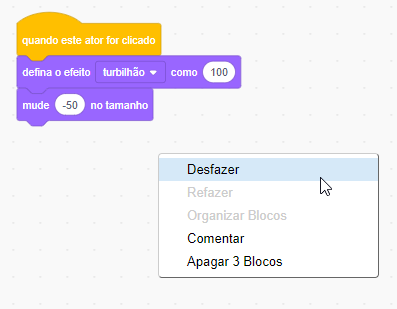
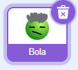
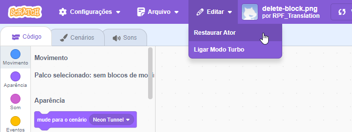

Você pode excluir um bloco clicando com o botão direito nele e selecionando **Apagar Bloco** no menu.

{:width="300px"}

Para excluir um grupo de blocos, clique com o botão esquerdo no bloco superior a ser excluído e arraste-o para o menu Blocos. Todos os blocos abaixo dele também serão excluídos.

Para restaurar blocos que você excluiu por engano, clique com o botão direito e selecione **Desfazer** no menu.

{:width="300px"}

--- no-print ---

--- /no-print ---

Você também pode excluir um ator clicando na lixeira do ator, dentro do painel Ator.

{:width="200px"}

Para restaurar um ator, incluindo todos os seus blocos de código, vá ao menu Editar e selecione **Restaurar Ator**

{:width="400px"}

--- no-print ---

--- /no-print ---
