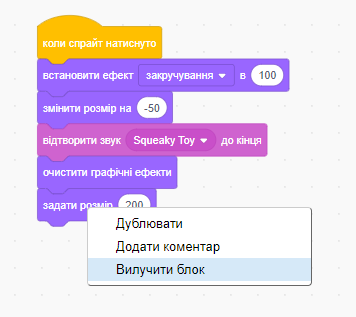
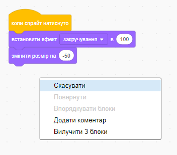
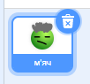
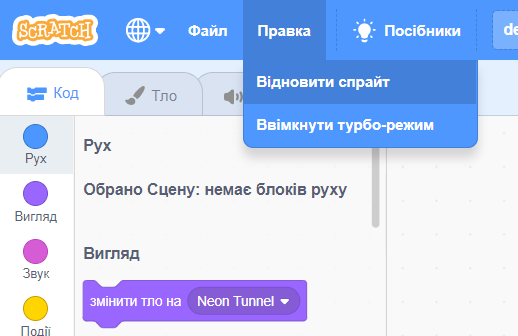

Ти можеш видалити блок, клацнувши по ньому правою кнопкою миші та вибравши пункт з меню **Вилучити блок**.

{:width="300px"}

Щоб видалити групу блоків, клацни лівою кнопкою миші по верхньому блоку, який потрібно видалити, і перетягни його в меню «Блоки». Всі блоки під ним також будуть видалені.

Щоб відновити помилково видалені блоки, клацни правою кнопкою миші та вибери в меню **Скасувати**.

{:width="300px"}

--- no-print ---

--- /no-print ---

Ти також можеш видалити спрайт, натиснувши на Смітник на Панелі спрайтів.

{:width="200px"}

Щоб відновити спрайт, включаючи всі його блоки коду, перейди в меню «Редагування» і вибери **Відновити спрайт**

{:width="400px"}

--- no-print ---

--- /no-print ---
